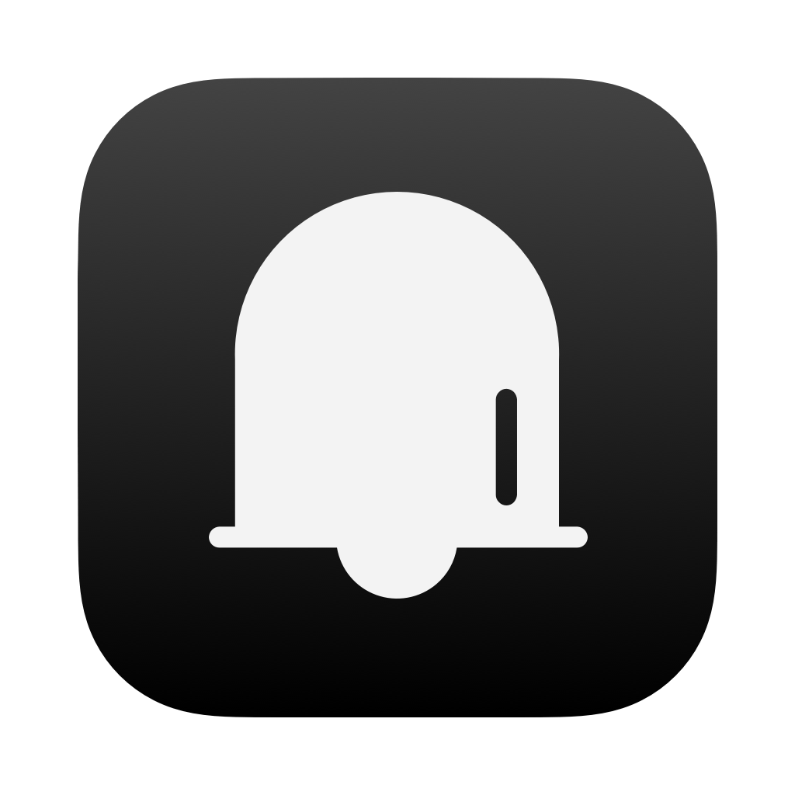

# Later

**Later** is a macOS app, that sits in the menubar and helps in creating post-it like reminders.

## Motivation

When working as a consultant, I sometimes have to record tasks on short notice that I need to work through during the day. This can for example include:

- Sending out an important email in 2 hours
- Fix a non-critical bug by the end of the day
- Call a colleague back in 15 minutes
- ...

Thus, I needed a simple app to create reminders in a human-friendly syntax.

## Installation

[**Download**](https://github.com/nicolai92/later/releases/tag/v1.0), unzip and move `Later.app` to the `/Applications/` directory.

## Usage

**Later** sends notifications based on the *When* text input field. Valid identifiers are:

|            | **Identifier**                                                                                       |
| ---------- | ---------------------------------------------------------------------------------------------------- |
| **Hour**   | "hr", "hr.", "hrs", "hrs.", "hour", "hours", "std", "std.", "stunde", "stunden"                      |
| **Minute** | "min", "min.", "mins", "mins.", "minute", "minutes", "minuten"                                       |
| **Second** | "s", "s.", "sec", "sec.", "secs", "secs.", "second", "seconds", "sek", "sek.", "sekunde", "sekunden" |

Please note, that access to notifications is granted for the app to work properly.
